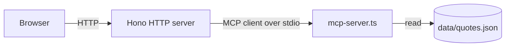

# tech-movie-quotes-backend

A small Node + TypeScript HTTP server that serves the expanded
tech-movie-quotes catalog. It is the optional companion to
[tech-movie-quotes-frontend](https://github.com/santiagogarza/tech-movie-quotes-frontend);
without it, the frontend falls back to a bundled 25-quote baseline.

The HTTP layer is built with [Hono](https://hono.dev). Quote data lives
in [`data/quotes.json`](data/quotes.json) and is exposed through a
bundled **stdio MCP server** that the HTTP layer spawns as a child
process and talks to as an MCP client. The browser never speaks MCP
directly — same pattern as Claude Desktop and other MCP hosts.

## Catalog

- 6 decades: `70s`, `80s`, `90s`, `2000s`, `2010s`, `2020s`
- 15 quotes per decade, 90 total
- Each entry: `{ decade, year, movie, quote }`

## Prerequisites

- Node 20 or newer
- pnpm (`packageManager: pnpm@9.15.0`). Enable with `corepack enable`
  if you don't have it.

## Setup

```bash
pnpm install
pnpm dev
```

The server logs `listening on http://localhost:8787` once the MCP
child process has connected.

## Verify

```bash
curl http://localhost:8787/health
# {"ok":true,"mcp":"connected","decades":["70s","80s","90s","2000s","2010s","2020s"],"quotesPerDecade":15}

curl http://localhost:8787/quotes/80s | jq '.quotes[0]'
# {"decade":"80s","year":1982,"movie":"Tron","quote":"Greetings, programs!"}

curl http://localhost:8787/mcp-info | jq '{name, transport, command, args, tools: .tools | map(.name)}'
# {
#   "name": "tech-movie-quotes-mcp",
#   "transport": "stdio",
#   "command": "/.../node",
#   "args": ["/.../tsx/dist/cli.mjs", "/.../src/mcp-server.ts"],
#   "tools": ["list_decades", "get_quotes", "get_quote_count"]
# }
```

Invalid decades return `400`:

```bash
curl -i http://localhost:8787/quotes/60s
# HTTP/1.1 400 Bad Request
# {"error":"invalid_decade","message":"Unknown decade \"60s\". ...","decades":[...]}
```

## Configuration

| Variable | Default | Purpose |
| --- | --- | --- |
| `PORT` | `8787` | HTTP port |
| `CORS_ORIGIN` | `*` | Comma-separated CORS allow-list. Default permits any origin so the local Vite dev server (`http://localhost:5173`) works without extra config. |

Copy `.env.example` to `.env` to override.

## Endpoints

| Method | Path | Returns |
| --- | --- | --- |
| `GET` | `/` | Server identity, tool surface, decade list |
| `GET` | `/health` | `{ ok, mcp, decades, quotesPerDecade }` — what the frontend probes |
| `GET` | `/quotes/:decade` | `{ decade, count, quotes: [...] }` for a valid decade, `400` otherwise |
| `GET` | `/mcp-info` | Live MCP-server metadata: transport, spawn command, args, cwd, tool list, source preview |

## MCP architecture

This repo demonstrates the **stdio MCP** transport. There are two
processes:

1. **HTTP server** ([`src/server.ts`](src/server.ts)) — accepts browser
   requests, owns one long-lived `Client` instance from
   `@modelcontextprotocol/sdk`.
2. **MCP server** ([`src/mcp-server.ts`](src/mcp-server.ts)) — a tiny
   stdio process that exposes three tools backed by
   `data/quotes.json`:
   - `list_decades` — `{ decades, quotesPerDecade }`
   - `get_quotes { decade }` — all quotes for a decade
   - `get_quote_count { decade }` — count for a decade

[`src/lib/mcp-client.ts`](src/lib/mcp-client.ts) spawns the MCP server
as a child process using `StdioClientTransport` from
`@modelcontextprotocol/sdk/client/stdio.js`. The exact command line is:

```
<node> <repo>/node_modules/tsx/dist/cli.mjs <repo>/src/mcp-server.ts
```

You can see this live by hitting `GET /mcp-info`.



### Inspecting the MCP server directly

The MCP server speaks stdio, so any MCP-aware client can talk to it.
The official Inspector is easiest:

```bash
npx @modelcontextprotocol/inspector tsx src/mcp-server.ts
```

This opens a UI that lists the tools, lets you call them with
arguments, and shows the raw responses.

You can also run the MCP server standalone (it will just wait on stdin
for MCP framing):

```bash
pnpm mcp
```

## Cursor cloud agents

This repo includes a [`.cursor/environment.json`](.cursor/environment.json)
with two terminals:

- `dev` runs `pnpm dev` (the HTTP server + child MCP process)
- `mcp-inspect` runs `pnpm mcp` (just the MCP server, ready for the
  Inspector or another MCP client to attach)

There is intentionally **no per-repo Dockerfile**. When this repo runs
inside a Cursor cloud agent session in
[modal-pooled-workers](https://github.com/santiagogarza/modal-pooled-workers),
the Modal worker image owns the container. The same
`environment.json` install/start commands also work for Cursor's
managed background agents.

## Scripts

```bash
pnpm dev         # tsx watch src/server.ts (recommended)
pnpm start       # tsx src/server.ts (no watch)
pnpm mcp         # tsx src/mcp-server.ts (stdio MCP only)
pnpm typecheck   # tsc --noEmit
```

## Demo script

1. `pnpm install && pnpm dev` — the server logs `MCP connected; 6 decades, 15 quotes per decade`.
2. `curl http://localhost:8787/health` — show the JSON response.
3. `curl http://localhost:8787/mcp-info | jq` — show that the HTTP
   layer really is spawning a stdio MCP child process. Point out the
   `command` + `args` and the tool list.
4. Start
   [tech-movie-quotes-frontend](https://github.com/santiagogarza/tech-movie-quotes-frontend)
   with `pnpm dev`. The pill in the corner flips to **Connected to
   backend** within ~4 seconds and the film year appears next to each
   title.
5. Optional: `npx @modelcontextprotocol/inspector tsx src/mcp-server.ts`
   to drive the MCP tools directly without the HTTP layer.
